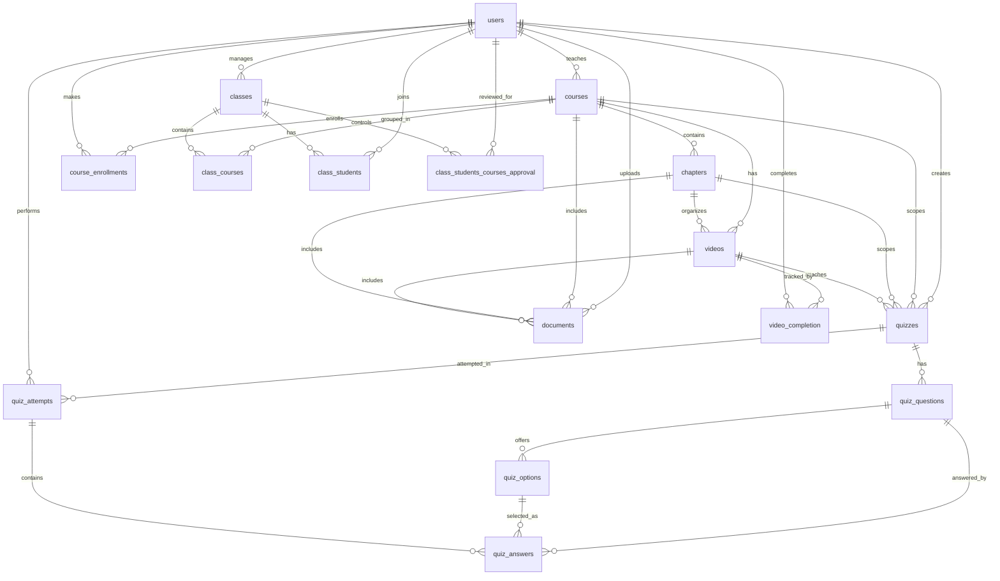
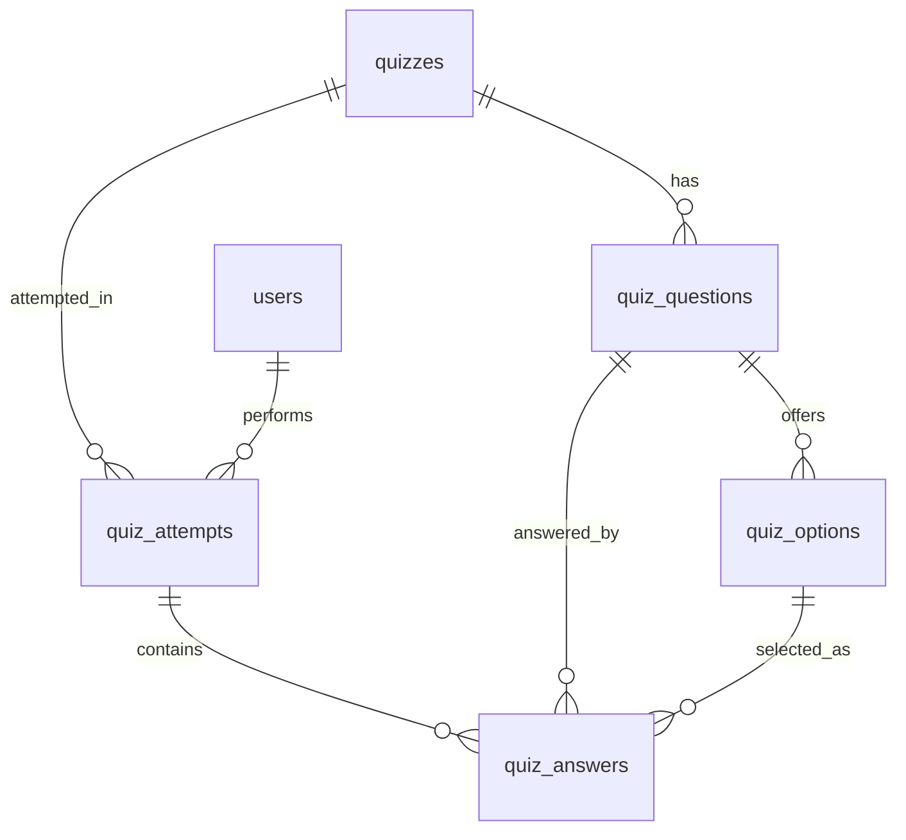
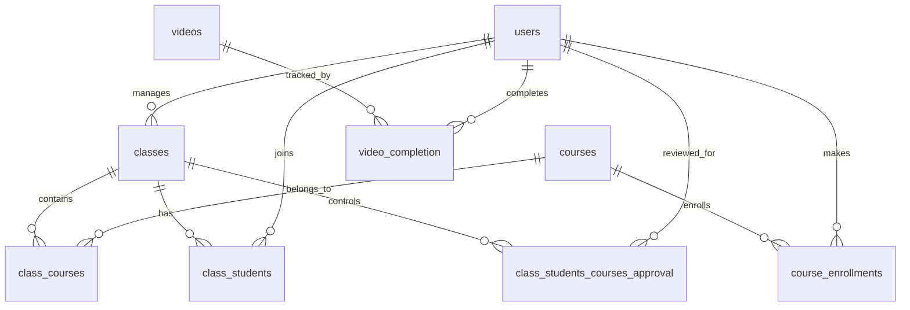
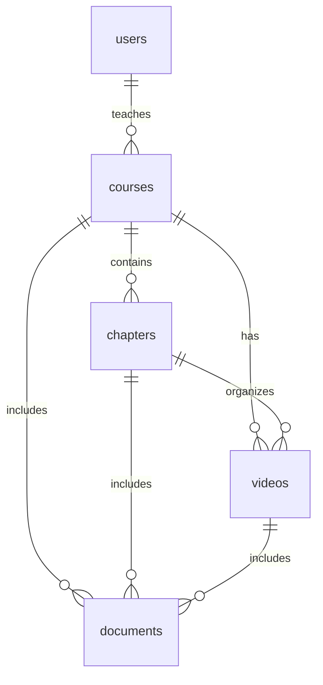

# So Do ERD De Xuat

Tai lieu nay cung cap so do ERD duoi dang Mermaid de chen vao bao cao hoac xuat thanh hinh.

## 1. ERD tong the

Caption goi y:

- `Hinh 3.1. So do ERD tong the cua he thong LMS CSDLNC`

## 2. ERD nhom Quiz

Caption goi y:

- `Hinh 3.2. So do quan he du lieu cua phan danh gia va quiz`

## 3. ERD nhom Class va Enrollment

Caption goi y:

- `Hinh 3.3. So do quan he du lieu cua nhom lop hoc, ghi danh va tien do hoc tap`

## 4. ERD nhom Noi dung hoc tap

Caption goi y:

- `Hinh 3.4. So do quan he du lieu cua nhom noi dung hoc tap`
