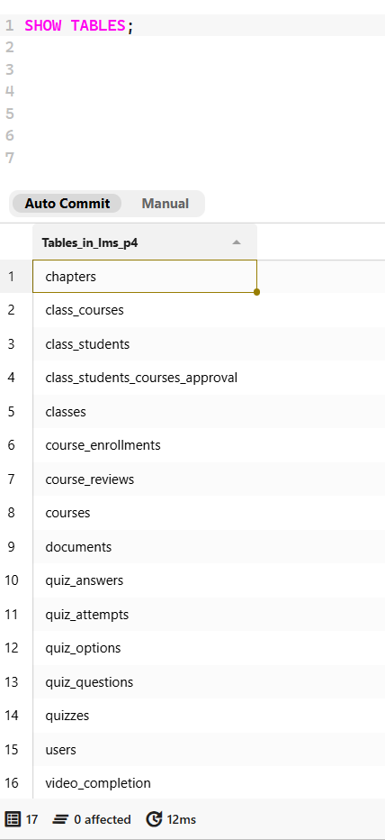
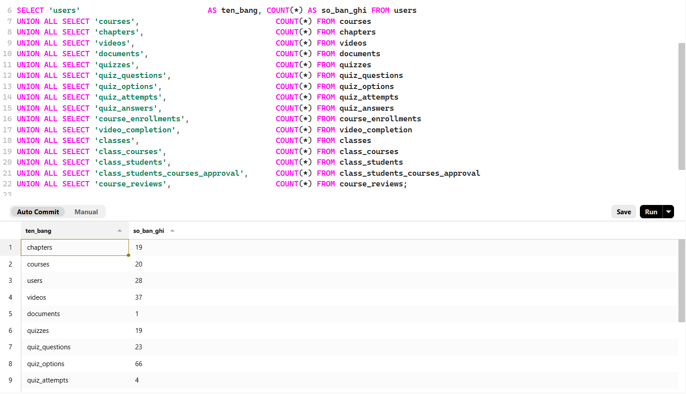
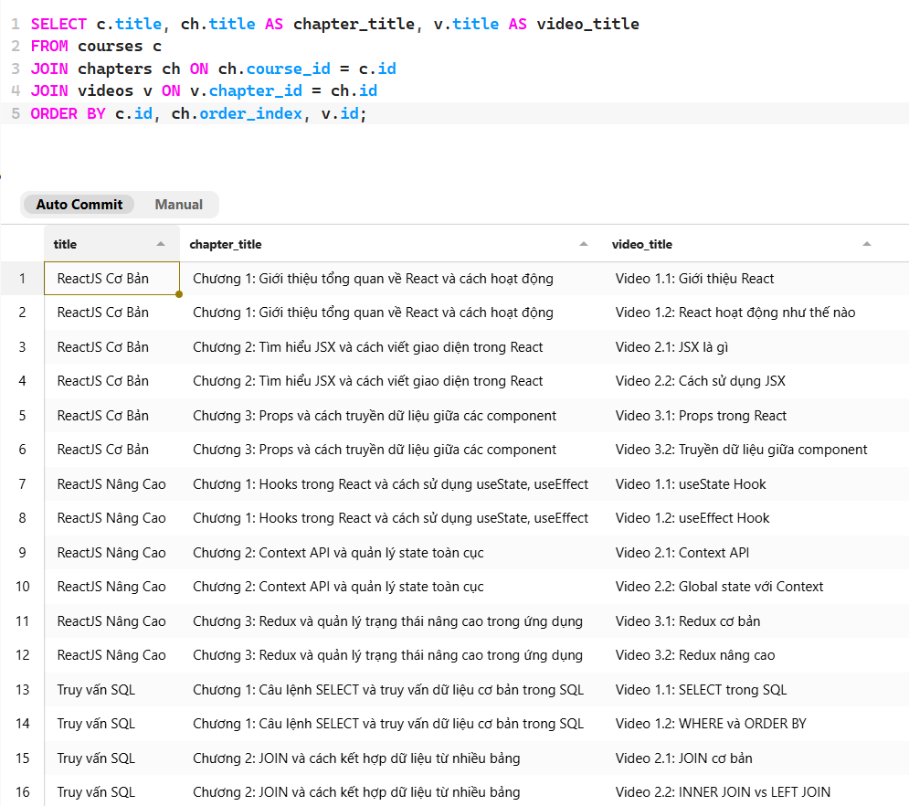
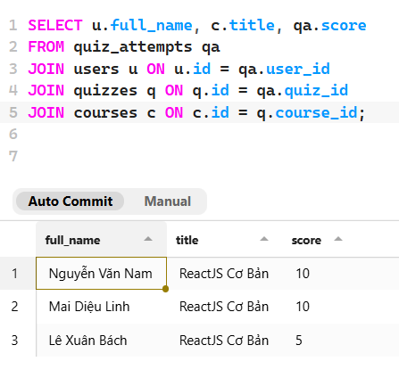

# Chương 4. Khởi tạo và triển khai cơ sở dữ liệu

## 4.1. Mục tiêu khởi tạo cơ sở dữ liệu

Mục tiêu của giai đoạn khởi tạo cơ sở dữ liệu là hình thành đầy đủ lược đồ lưu trữ cho hệ thống LMS, bảo đảm hệ thống có thể quản lý nhất quán dữ liệu người dùng, khóa học, nội dung học tập, bài kiểm tra, tiến độ học tập và lớp học. Ở mức triển khai, phần này không chỉ dừng ở việc tạo được các bảng dữ liệu, mà còn phải thể hiện rõ các khóa chính, khóa ngoại, ràng buộc duy nhất, chỉ mục và dữ liệu mẫu cần thiết để phục vụ kiểm thử.

Trong phạm vi báo cáo, Chương 4 tập trung làm rõ ba nội dung chính. Thứ nhất, mô tả bộ script lược đồ chính dùng để khởi tạo toàn bộ cơ sở dữ liệu. Thứ hai, trình bày bộ migration mô phỏng quá trình lược đồ được mở rộng theo từng giai đoạn nghiệp vụ. Thứ ba, minh họa quy trình nạp cấu trúc dữ liệu, nạp dữ liệu mẫu và kiểm tra kết quả khởi tạo trên môi trường MySQL.

## 4.2. Thành phần script khởi tạo

Quá trình khởi tạo cơ sở dữ liệu của đề tài được tổ chức thành ba nhóm script có vai trò khác nhau:

| Nhóm script | Vai trò |
| --- | --- |
| Lược đồ chính | Tạo toàn bộ cơ sở dữ liệu ở trạng thái hoàn chỉnh nhất, bao gồm bảng, khóa, ràng buộc và chỉ mục chính. |
| Dữ liệu mẫu | Nạp dữ liệu khởi tạo để phục vụ kiểm thử truy vấn, minh họa nghiệp vụ và đối chiếu kết quả sau khi triển khai. |
| Migration phiên bản | Quản lý và theo dõi các thay đổi của lược đồ dữ liệu theo từng phiên bản. |

Việc tách riêng ba nhóm script giúp phần triển khai rõ ràng hơn về mặt kỹ thuật. Script lược đồ chính đại diện cho trạng thái cấu trúc dữ liệu hoàn chỉnh của hệ thống tại thời điểm hiện tại; script dữ liệu mẫu đóng vai trò tạo dữ liệu nền; còn bộ migration cho thấy lược đồ đã được mở rộng dần theo nhu cầu nghiệp vụ như thế nào. Chi tiết tên file và nội dung cụ thể được trình bày ở phần phụ lục.

## 4.3. Cấu trúc lược đồ chính

Lược đồ chính của hệ thống được xây dựng dưới dạng một script khởi tạo tổng thể. Script này tạo tổng cộng 17 bảng dữ liệu, có thể nhóm thành các cụm chức năng như sau:

| Nhóm dữ liệu | Các bảng tiêu biểu | Mục đích |
| --- | --- | --- |
| Người dùng và phân quyền | `users` | Quản lý tài khoản, vai trò `admin`, `teacher`, `student`, thông tin hồ sơ và tiểu sử giảng viên. |
| Nội dung khóa học | `courses`, `chapters`, `videos`, `documents` | Mô tả khóa học, mức độ khóa học, yêu cầu đầu vào, mục tiêu học tập, cấu trúc chương, video bài giảng và tài liệu đính kèm. |
| Kiểm tra đánh giá | `quizzes`, `quiz_questions`, `quiz_options`, `quiz_attempts`, `quiz_answers` | Lưu cấu trúc bài kiểm tra, câu hỏi, phương án trả lời và lịch sử làm bài. |
| Tiến độ học tập | `course_enrollments`, `video_completion` | Theo dõi việc ghi danh khóa học và trạng thái hoàn thành video của học viên. |
| Quản lý lớp học và phản hồi | `classes`, `class_courses`, `class_students`, `class_students_courses_approval`, `course_reviews` | Tổ chức lớp học, gán khóa học cho lớp, quản lý thành viên và ghi nhận đánh giá khóa học. |

Lược đồ này thể hiện rõ đặc điểm của một hệ thống LMS có cả phần học nội dung, đánh giá kết quả và quản lý lớp học. Các quan hệ phụ thuộc chính đều được ràng buộc bằng khóa ngoại, ví dụ: `courses.teacher_id` tham chiếu `users.id`, `chapters.course_id` tham chiếu `courses.id`, `videos.chapter_id` tham chiếu `chapters.id`, `quiz_attempts.quiz_id` tham chiếu `quizzes.id` và `class_students.student_id` tham chiếu `users.id`.

Bên cạnh đó, schema cũng bổ sung các ràng buộc và chỉ mục phục vụ trực tiếp cho vận hành. Một số ví dụ tiêu biểu gồm `username UNIQUE`, `email UNIQUE`, `class_code UNIQUE`, `UNIQUE (user_id, course_id)` trong `course_enrollments`, `UNIQUE (user_id, video_id)` trong `video_completion`, cùng các chỉ mục như `idx_user_role`, `idx_course_public`, `idx_chapter_order`, `idx_video_chapter`, `idx_quiz_type`, `idx_attempt_user_quiz` và `idx_course_rating`. Những thành phần này vừa giúp bảo đảm toàn vẹn dữ liệu, vừa tạo nền tảng cho tối ưu truy vấn ở Chương 5.

Chi tiết các lệnh `CREATE TABLE`, khai báo khóa ngoại, ràng buộc duy nhất và chỉ mục được trình bày ở phần phụ lục để bảo đảm mạch nội dung chính của chương tập trung vào cấu trúc triển khai và ý nghĩa của lược đồ thay vì sa vào chi tiết cú pháp.

## 4.4. Quá trình mở rộng lược đồ dữ liệu qua các phiên bản migration

Bên cạnh script lược đồ tổng thể, đề tài sử dụng bộ migration để quản lý và theo dõi các thay đổi của cơ sở dữ liệu qua từng phiên bản. Cách tổ chức này phù hợp với thực tế phát triển phần mềm, khi lược đồ dữ liệu thường được bổ sung và hoàn thiện dần theo sự mở rộng của nghiệp vụ.

| Phiên bản | Nội dung mở rộng chính |
| --- | --- |
| `V1` | Khởi tạo dữ liệu lõi của hệ thống, gồm người dùng, hồ sơ giảng viên, khóa học, chương học và video. |
| `V2` | Bổ sung nhóm chức năng kiểm tra, đánh giá kết quả học tập của học viên. |
| `V3` | Bổ sung ghi danh khóa học, theo dõi tiến độ học tập và tài liệu học tập. |
| `V4` | Bổ sung mô hình quản lý lớp học, cơ chế phê duyệt học viên và phản hồi khóa học. |

### Phiên bản V1 - Khởi tạo lõi hệ thống

Phiên bản `V1` đại diện cho giai đoạn hệ thống mới hình thành, khi nghiệp vụ tập trung vào việc quản lý người dùng, khóa học và nội dung học tập cơ bản. Bốn bảng trọng tâm ở giai đoạn này là `users`, `courses`, `chapters` và `videos`. Bảng `users` không chỉ lưu tài khoản và vai trò mà còn có thể lưu tiểu sử giảng viên; bảng `courses` lưu thêm các thông tin mô tả như mức độ khóa học, yêu cầu đầu vào và mục tiêu học tập. Đây là mức tối thiểu để một hệ thống LMS có thể lưu được tài khoản, cấu trúc khóa học và video bài giảng.

Điểm quan trọng của `V1` là đã thiết lập sẵn các quan hệ nền tảng giữa giáo viên với khóa học, giữa khóa học với chương và giữa chương với video. Nhờ đó, các phiên bản sau chỉ cần mở rộng theo chiều ngang mà không phải thay đổi lại toàn bộ mô hình lõi.

### Phiên bản V2 - Bổ sung kiểm tra đánh giá

Phiên bản `V2` mở rộng lược đồ sang nhóm nghiệp vụ đánh giá kết quả học tập. Các bảng `quizzes`, `quiz_questions`, `quiz_options`, `quiz_attempts` và `quiz_answers` được thêm vào để lưu cấu trúc bài kiểm tra, nội dung câu hỏi, phương án trả lời và lịch sử làm bài của học viên.

Sự xuất hiện của `V2` cho thấy hệ thống không còn chỉ dừng ở mức phân phối nội dung học tập, mà đã bắt đầu quản lý được quá trình kiểm tra và ghi nhận kết quả. Đây cũng là nhóm bảng tạo dữ liệu đầu vào cho các truy vấn phân tích kết quả học tập ở các chương sau.

### Phiên bản V3 - Bổ sung ghi danh, tiến độ và tài liệu

Phiên bản `V3` bổ sung các bảng `course_enrollments`, `video_completion` và `documents`. Giai đoạn này đánh dấu sự chuyển dịch từ mô hình “có nội dung để học” sang mô hình “quản lý được quá trình học”. Học viên không chỉ xem khóa học, mà còn có trạng thái ghi danh và tiến độ hoàn thành nội dung.

Việc thêm bảng `documents` cũng làm cho lược đồ đầy đủ hơn về mặt học liệu, vì ngoài video còn có tài liệu tệp đính kèm gắn với khóa học, chương hoặc video cụ thể.

### Phiên bản V4 - Bổ sung quản lý lớp học

Phiên bản `V4` là bước mở rộng sang bài toán tổ chức lớp học và phản hồi khóa học, gồm các bảng `classes`, `class_courses`, `class_students`, `class_students_courses_approval` và `course_reviews`. Đây là lớp nghiệp vụ cao hơn so với quản lý khóa học đơn lẻ, vì hệ thống cần theo dõi việc học viên thuộc lớp nào, lớp được gắn với khóa học nào, trạng thái tham gia của học viên trong từng ngữ cảnh và đánh giá của học viên sau quá trình học.

Nhờ `V4`, cơ sở dữ liệu hỗ trợ được mô hình dạy học theo lớp thay vì chỉ theo danh mục khóa học mở. Đây cũng là cơ sở để hệ thống mở rộng các chức năng như phê duyệt học viên, quản lý lớp riêng, phân phối khóa học theo nhóm và thống kê phản hồi thông qua điểm đánh giá khóa học.

Mỗi phiên bản migration đều đi kèm script `down` tương ứng. Việc chuẩn bị cả chiều triển khai và chiều hoàn tác giúp lược đồ phù hợp hơn với tư duy quản lý thay đổi trong thực tế, đồng thời làm rõ rằng cơ sở dữ liệu không chỉ được tạo ra một lần mà còn có thể được bảo trì theo vòng đời phát triển.

## 4.5. Quy trình khởi tạo và nạp dữ liệu mẫu

Sau khi chuẩn bị đầy đủ các script cần thiết, quá trình khởi tạo cơ sở dữ liệu được thực hiện theo một trình tự thống nhất để bảo đảm lược đồ, ràng buộc và dữ liệu mẫu được nạp đúng thứ tự. Trình tự này giúp hạn chế lỗi phụ thuộc giữa các bảng, đặc biệt ở những bảng có quan hệ khóa ngoại.

| Bước | Nội dung thực hiện | Kết quả mong đợi |
| --- | --- | --- |
| 1 | Tạo cơ sở dữ liệu rỗng với bộ mã ký tự hỗ trợ tiếng Việt. | Cơ sở dữ liệu sẵn sàng để nạp cấu trúc bảng. |
| 2 | Nạp script lược đồ chính. | Toàn bộ bảng, khóa chính, khóa ngoại, ràng buộc và chỉ mục được tạo đầy đủ. |
| 3 | Nạp script dữ liệu mẫu. | Hệ thống có dữ liệu ban đầu để kiểm thử và minh họa nghiệp vụ. |
| 4 | Kiểm tra lại danh sách bảng, số lượng bản ghi và một số quan hệ dữ liệu tiêu biểu. | Cơ sở dữ liệu ở trạng thái có thể sử dụng cho các phần phân tích tiếp theo. |

Trong trường hợp muốn trình bày theo hướng phát triển qua nhiều phiên bản, bước nạp lược đồ tổng thể có thể được thay bằng việc áp dụng tuần tự các migration từ `V1` đến `V4`. Cách thực hiện này giúp thể hiện rõ quá trình cơ sở dữ liệu được bổ sung theo từng nhóm nghiệp vụ, từ phần lõi của hệ thống đến kiểm tra đánh giá, tiến độ học tập, quản lý lớp học và phản hồi khóa học.

Các lệnh triển khai cụ thể được trình bày tại phần phụ lục để nội dung chính của chương tập trung vào quy trình và ý nghĩa của từng bước khởi tạo.

## 4.6. Kiểm tra kết quả khởi tạo

Sau khi nạp schema và dữ liệu mẫu, cần kiểm tra lại kết quả khởi tạo để bảo đảm cơ sở dữ liệu đã ở trạng thái sẵn sàng sử dụng. Các điểm cần xác nhận gồm:

- danh sách bảng đã được tạo đầy đủ;
- các quan hệ khóa ngoại hoạt động đúng;
- dữ liệu mẫu đã được nạp vào các bảng lõi;
- các truy vấn kiểm tra cơ bản có thể thực thi thành công.

Một số truy vấn kiểm tra tiêu biểu được sử dụng để đối chiếu kết quả khởi tạo gồm:

```sql
SHOW TABLES;
```

```sql
SELECT COUNT(*) AS total_users FROM users;
SELECT COUNT(*) AS total_courses FROM courses;
SELECT COUNT(*) AS total_classes FROM classes;
SELECT COUNT(*) AS total_quizzes FROM quizzes;
```

```sql
SELECT c.title, ch.title AS chapter_title, v.title AS video_title
FROM courses c
JOIN chapters ch ON ch.course_id = c.id
JOIN videos v ON v.chapter_id = ch.id
ORDER BY c.id, ch.order_index, v.id;
```

```sql
SELECT u.full_name, c.title, qa.score
FROM quiz_attempts qa
JOIN users u ON u.id = qa.user_id
JOIN quizzes q ON q.id = qa.quiz_id
JOIN courses c ON c.id = q.course_id;
```

Kết quả kiểm tra danh sách bảng sau khi khởi tạo được thể hiện ở Hình 4.1. Kết quả này cho thấy các bảng chính của hệ thống đã được tạo thành công và sẵn sàng cho bước nạp dữ liệu mẫu.



Minh chứng này xác nhận bước nạp schema đã tạo được các bảng chính của cơ sở dữ liệu. Việc kiểm tra danh sách bảng là bước đầu tiên để bảo đảm các script khởi tạo đã chạy đúng, trước khi tiếp tục nạp dữ liệu mẫu và thực hiện các truy vấn kiểm thử.

Sau khi nạp dữ liệu mẫu, báo cáo tiếp tục kiểm tra số lượng bản ghi ở các bảng quan trọng. Hình 4.2 cho thấy dữ liệu đã được đưa vào nhiều nhóm bảng khác nhau như người dùng, khóa học, chương học, video, quiz và các bảng liên quan đến lớp học.



Kết quả đếm số bản ghi cho thấy dữ liệu seed đã được nạp vào nhiều nhóm bảng khác nhau. Điều này giúp khẳng định cơ sở dữ liệu không chỉ có cấu trúc bảng, mà còn có dữ liệu ban đầu đủ để kiểm tra quan hệ, chạy truy vấn minh họa và phục vụ phần tối ưu ở chương sau.

Để kiểm tra quan hệ giữa các bảng nội dung học tập, báo cáo sử dụng truy vấn kết hợp `courses`, `chapters` và `videos`. Kết quả ở Hình 4.3 cho thấy dữ liệu khóa học, chương học và video đã liên kết đúng theo khóa ngoại.



Truy vấn liên kết khóa học, chương học và video chứng minh các khóa ngoại giữa ba nhóm bảng nội dung đang hoạt động đúng. Nếu kết quả trả về đúng cấu trúc khóa học - chương - video, có thể kết luận dữ liệu học liệu đã được tổ chức đúng theo mô hình phân cấp của hệ thống.

Ngoài nhóm dữ liệu nội dung học tập, báo cáo cũng kiểm tra dữ liệu bài kiểm tra thông qua truy vấn kết hợp `quiz_attempts`, `users`, `quizzes` và `courses`. Hình 4.4 minh họa kết quả điểm làm bài của học viên theo khóa học.



Truy vấn điểm làm bài kết hợp nhiều bảng như người dùng, khóa học, bài kiểm tra và lượt làm bài. Kết quả này cho thấy dữ liệu đánh giá không bị tách rời, mà có thể truy ngược về học viên và khóa học tương ứng, phục vụ các báo cáo kết quả học tập.

Nếu các truy vấn trên trả về kết quả hợp lý, có thể kết luận rằng lược đồ đã được tạo đúng, các quan hệ giữa bảng đã được liên kết đúng hướng và bộ dữ liệu mẫu đủ để phục vụ cho các bước phân tích, tối ưu và vận hành ở các chương tiếp theo.

## 4.7. Nhận xét

Qua quá trình khởi tạo và kiểm tra, cơ sở dữ liệu của hệ thống LMS đã hình thành đầy đủ các nhóm bảng cần thiết cho những nghiệp vụ chính như quản lý người dùng, khóa học, nội dung học tập, bài kiểm tra, tiến độ học tập và lớp học. Kết quả kiểm tra ở các hình trên cho thấy schema đã được tạo thành công, dữ liệu mẫu đã được nạp vào các bảng quan trọng và các truy vấn liên kết giữa nhiều bảng có thể thực thi đúng.

Điểm đáng chú ý là phần khởi tạo không chỉ tạo ra các bảng riêng lẻ, mà còn kiểm tra được mối liên hệ giữa các bảng thông qua những truy vấn nghiệp vụ cụ thể. Truy vấn khóa học - chương học - video cho thấy dữ liệu nội dung học tập đã được tổ chức theo đúng cấu trúc. Truy vấn kết quả làm bài cho thấy nhóm dữ liệu người dùng, bài kiểm tra và khóa học đã liên kết được với nhau. Điều này giúp xác nhận rằng lược đồ có thể phục vụ các thao tác truy vấn thực tế, thay vì chỉ tồn tại ở mức định nghĩa bảng.

Nhìn chung, phần khởi tạo cơ sở dữ liệu đã tạo được nền tảng ổn định cho các nội dung tiếp theo của báo cáo. Dữ liệu mẫu sau khi nạp có thể được sử dụng để phân tích chỉ mục và hiệu năng truy vấn ở Chương 5, đồng thời cũng là cơ sở cho các phần sao lưu, phục hồi và replication ở những chương sau. Nếu triển khai ở quy mô lớn hơn, hệ thống vẫn cần tiếp tục chuẩn hóa bộ migration và mở rộng dữ liệu kiểm thử, nhưng trong phạm vi đề tài hiện tại, quy trình khởi tạo đã đáp ứng được mục tiêu đặt ra.
