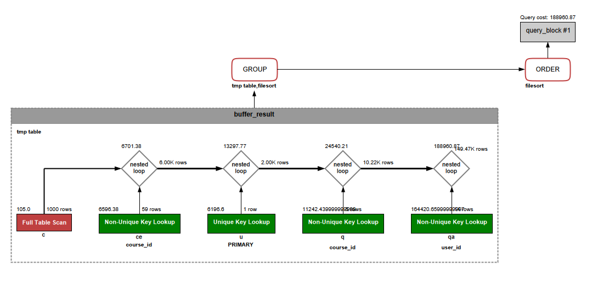
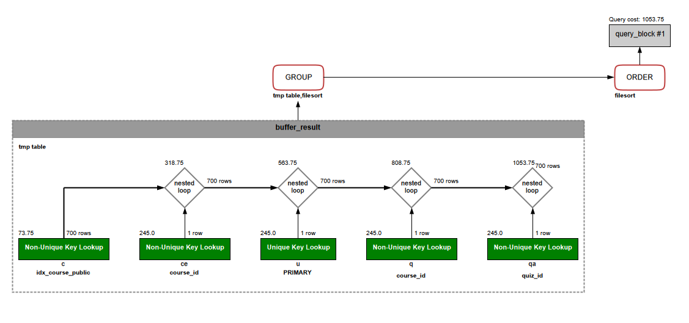
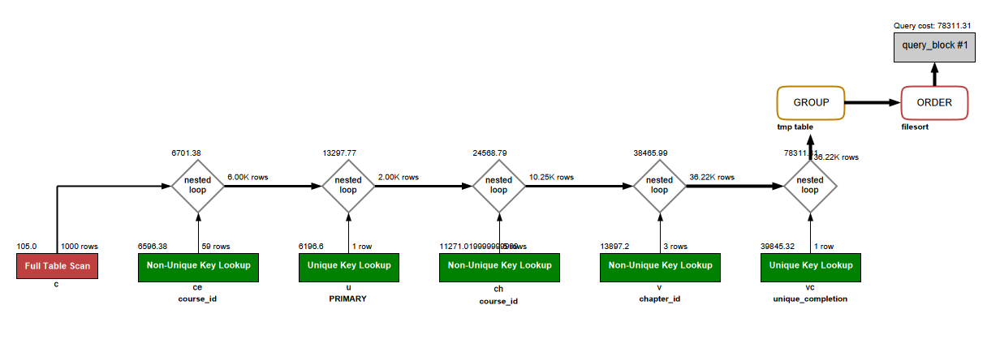
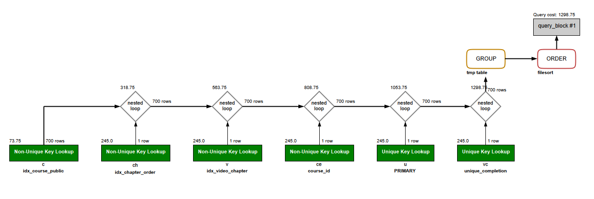

# Chương 5. Tối ưu và vận hành cơ sở dữ liệu

## 5.1. Vai trò của tối ưu cơ sở dữ liệu

Tối ưu cơ sở dữ liệu nhằm đảm bảo hệ thống có thể truy vấn dữ liệu nhanh, ổn định và duy trì được hiệu năng khi khối lượng dữ liệu tăng lên. Đối với hệ thống LMS, dữ liệu phát sinh không chỉ nằm ở bảng người dùng hay khóa học, mà còn tăng liên tục ở các bảng ghi danh, tiến độ học tập, lịch sử làm bài, câu trả lời của học viên, dữ liệu hoàn thành video và đánh giá khóa học.

Nếu không quan tâm đến tối ưu truy vấn ngay từ giai đoạn thiết kế, hệ thống có thể gặp tình trạng truy vấn chậm, thời gian phản hồi tăng cao và khó mở rộng khi số lượng học viên tham gia học tập ngày càng lớn. Vì vậy, chương này tập trung vào ba nội dung chính: các chỉ mục đã được thiết kế trong lược đồ, cách chọn truy vấn benchmark đại diện cho nghiệp vụ LMS, và phân tích kết quả `EXPLAIN` trước/sau khi có chỉ mục.

## 5.2. Cơ sở tối ưu trong lược đồ

Trong lược đồ chính thức của hệ thống, các bảng đều được thiết kế với khóa chính, khóa ngoại và một số chỉ mục phục vụ trực tiếp cho truy vấn nghiệp vụ. Khóa chính giúp định danh duy nhất từng bản ghi và hỗ trợ truy vấn theo `id`. Khóa ngoại giúp duy trì toàn vẹn tham chiếu giữa các bảng như khóa học, chương, video, ghi danh và bài kiểm tra. Bên cạnh đó, các chỉ mục tường minh được bổ sung trên những cột thường xuyên xuất hiện trong điều kiện lọc, sắp xếp hoặc nối bảng.

Điểm quan trọng là chương này không tạo thêm một bộ chỉ mục mới ngoài lược đồ chính thức. Cấu hình sau tối ưu sử dụng đúng lược đồ chính thức của hệ thống, còn cấu hình trước tối ưu chỉ là lược đồ phục vụ thực nghiệm, được giản lược các chỉ mục tối ưu tường minh nhưng vẫn giữ các ràng buộc nền tảng như `PRIMARY KEY`, `UNIQUE` và `FOREIGN KEY`. Cách làm này giúp chứng minh rằng các chỉ mục đã có trong thiết kế hiện tại thực sự có tác dụng đối với hiệu năng truy vấn.

## 5.3. Danh sách chỉ mục và mục đích sử dụng

Các chỉ mục tường minh trong lược đồ chính thức được tổng hợp như sau:

| Bảng | Tên chỉ mục | Cột | Mục đích sử dụng |
| --- | --- | --- | --- |
| `users` | `idx_user_role` | `role` | Hỗ trợ lọc người dùng theo vai trò như học viên, giáo viên hoặc quản trị viên. |
| `courses` | `idx_course_public` | `is_public` | Hỗ trợ lọc danh sách khóa học công khai để hiển thị cho học viên. |
| `chapters` | `idx_chapter_order` | `course_id, order_index` | Hỗ trợ lấy danh sách chương theo khóa học và sắp xếp đúng thứ tự học tập. |
| `videos` | `idx_video_chapter` | `chapter_id` | Hỗ trợ lấy danh sách video thuộc một chương cụ thể. |
| `quizzes` | `idx_quiz_type` | `quiz_type` | Hỗ trợ lọc bài kiểm tra theo phạm vi gắn với khóa học, chương hoặc video. |
| `quiz_attempts` | `idx_attempt_user_quiz` | `user_id, quiz_id` | Hỗ trợ tra cứu kết quả làm bài của học viên theo từng bài kiểm tra. |
| `classes` | `idx_class_code` | `class_code` | Hỗ trợ tìm kiếm lớp học theo mã lớp. |
| `course_reviews` | `idx_course_rating` | `course_id, rating` | Hỗ trợ thống kê đánh giá của một khóa học theo số sao. |

Ngoài các chỉ mục tường minh trên, một số ràng buộc `UNIQUE` cũng có tác dụng như chỉ mục vì hệ quản trị cần cấu trúc tra cứu nhanh để kiểm tra trùng lặp. Ví dụ:

| Bảng | Ràng buộc | Ý nghĩa |
| --- | --- | --- |
| `users` | `username UNIQUE` | Tránh trùng tên đăng nhập và hỗ trợ tra cứu tài khoản khi đăng nhập. |
| `users` | `email UNIQUE` | Tránh trùng email và hỗ trợ kiểm tra tài khoản theo email. |
| `classes` | `class_code UNIQUE` | Đảm bảo mỗi lớp có một mã lớp duy nhất. |
| `course_enrollments` | `UNIQUE (user_id, course_id)` | Tránh việc một học viên ghi danh trùng một khóa học. |
| `video_completion` | `UNIQUE (user_id, video_id)` | Tránh ghi nhận trùng trạng thái hoàn thành video. |
| `course_reviews` | `UNIQUE (user_id, course_id)` | Đảm bảo mỗi học viên chỉ đánh giá một khóa học một lần. |

Như vậy, hệ thống không chỉ dựa vào khóa chính mà còn có các chỉ mục gắn trực tiếp với cách dữ liệu được truy vấn trong nghiệp vụ LMS. Đây là cơ sở để các truy vấn báo cáo, theo dõi tiến độ và thống kê đánh giá vận hành hiệu quả hơn khi dữ liệu tăng lên.

## 5.4. Thiết lập thực nghiệm before/after

Để đánh giá tác động của chỉ mục, báo cáo sử dụng phương pháp so sánh trước và sau khi áp dụng các chỉ mục tối ưu. Ở cấu hình trước tối ưu, lược đồ cơ sở dữ liệu vẫn giữ nguyên cấu trúc bảng, khóa chính, khóa ngoại và các ràng buộc duy nhất cần thiết để đảm bảo tính đúng đắn của dữ liệu, nhưng loại bỏ các chỉ mục tường minh phục vụ tối ưu truy vấn. Ở cấu hình sau tối ưu, hệ thống sử dụng lược đồ chính thức với đầy đủ các chỉ mục đã được thiết kế cho các nghiệp vụ chính.

Hai cấu hình được nạp cùng một bộ dữ liệu mẫu và chạy cùng một tập truy vấn benchmark. Cách làm này giúp việc so sánh tập trung vào ảnh hưởng của chỉ mục, thay vì bị nhiễu bởi sự khác nhau về dữ liệu hoặc logic truy vấn. Kết quả được đánh giá thông qua biểu đồ `EXPLAIN` và chỉ số `query cost` do optimizer ước lượng.

Chỉ số `query cost` không phải là thời gian thực thi tuyệt đối, nhưng có giá trị tham khảo quan trọng vì nó phản ánh mức chi phí mà hệ quản trị dự đoán khi lựa chọn kế hoạch thực thi. Khi cùng một truy vấn và cùng một bộ dữ liệu cho thấy `query cost` giảm rõ rệt sau khi có chỉ mục, có thể kết luận rằng lược đồ tối ưu hơn đã giúp optimizer chọn được kế hoạch truy vấn hợp lý hơn.

## 5.5. Truy vấn benchmark và kết quả EXPLAIN

Báo cáo lựa chọn hai truy vấn đại diện cho nghiệp vụ có khả năng phát sinh thường xuyên trong hệ thống LMS.

Truy vấn thứ nhất là báo cáo kết quả học tập của học viên theo khóa học công khai. Truy vấn này kết hợp các bảng `users`, `course_enrollments`, `courses`, `quizzes` và `quiz_attempts` để thống kê số lần làm bài, điểm trung bình và lần làm bài gần nhất của học viên. Đây là dạng truy vấn phù hợp để đánh giá tác động của các chỉ mục như `idx_course_public`, `idx_user_role`, `idx_quiz_type` và `idx_attempt_user_quiz`.

Trong cấu hình `before`, truy vấn kết quả học tập có `query cost` khoảng `188960.87`. Biểu đồ cho thấy optimizer phải xử lý lượng dòng lớn hơn ở các bước nối bảng, đặc biệt ở nhóm bảng liên quan đến khóa học, bài kiểm tra và lịch sử làm bài. Việc xuất hiện `tmp table` và `filesort` cũng cho thấy truy vấn có chi phí xử lý bổ sung do có `GROUP BY` và `ORDER BY`.

Trong cấu hình `after`, `query cost` giảm xuống khoảng `1053.75`. Optimizer sử dụng các thao tác `Non-Unique Key Lookup` trên những chỉ mục phù hợp, ví dụ `idx_course_public` để lọc khóa học công khai và các chỉ mục phục vụ nối bảng với ghi danh, quiz và bài làm. Mặc dù truy vấn vẫn cần `tmp table` và `filesort` do yêu cầu tổng hợp và sắp xếp kết quả, chi phí tổng thể đã giảm rất mạnh so với cấu hình before.

Truy vấn thứ hai là phân rã tiến độ học tập của học viên theo từng chương. Truy vấn này kết hợp các bảng `users`, `course_enrollments`, `courses`, `chapters`, `videos` và `video_completion` để thống kê số video trong từng chương và số video học viên đã hoàn thành. Đây là truy vấn đại diện cho chức năng theo dõi tiến độ học tập trong LMS.

Trong cấu hình `before`, truy vấn tiến độ học tập có `query cost` khoảng `78311.31`. Biểu đồ cho thấy vẫn còn bước `Full Table Scan` trên bảng `courses` và chi phí nối tăng cao khi truy vấn mở rộng sang các bảng chương, video và trạng thái hoàn thành. Điều này phản ánh đặc điểm của các truy vấn tiến độ: dữ liệu thường phân tán qua nhiều bảng và dễ trở nên tốn kém nếu thiếu chỉ mục phù hợp.

Trong cấu hình `after`, `query cost` giảm xuống khoảng `1298.75`. Optimizer tận dụng `idx_course_public` để lọc khóa học công khai, `idx_chapter_order` để lấy chương theo khóa học và thứ tự, `idx_video_chapter` để lấy video theo chương, cùng với `unique_completion` để kiểm tra trạng thái hoàn thành video của từng học viên. Nhờ đó, truy vấn giảm đáng kể chi phí so với cấu hình before.

Bảng tổng hợp kết quả:

| Truy vấn | Cấu hình before | Cấu hình after | Nhận xét |
| --- | --- | --- | --- |
| Báo cáo kết quả học tập của học viên | `query cost` khoảng `188960.87` | `query cost` khoảng `1053.75` | Chỉ mục giúp giảm mạnh chi phí ước lượng và hỗ trợ tốt hơn cho các bước lọc, nối bảng. |
| Phân rã tiến độ học tập theo chương | `query cost` khoảng `78311.31` | `query cost` khoảng `1298.75` | Chỉ mục trên khóa học, chương, video và trạng thái hoàn thành giúp kế hoạch truy vấn gọn hơn. |

## 5.6. Nhận xét hiệu năng

Kết quả thực nghiệm cho thấy các chỉ mục trong lược đồ chính thức có tác động rõ rệt đến kế hoạch thực thi truy vấn. Ở cả hai truy vấn benchmark, cấu hình `after` đều có `query cost` thấp hơn nhiều so với cấu hình `before`. Điều này chứng minh rằng việc thiết kế chỉ mục không chỉ mang tính hình thức mà thực sự giúp hệ quản trị giảm chi phí tìm kiếm và nối dữ liệu.

Tuy nhiên, một số bước như `tmp table` và `filesort` vẫn xuất hiện trong biểu đồ `EXPLAIN`. Đây là hiện tượng hợp lý vì hai truy vấn đều có nhóm kết quả, tính toán tổng hợp và sắp xếp dữ liệu bằng `GROUP BY`, `HAVING` hoặc `ORDER BY`. Chỉ mục có thể giúp giảm chi phí lọc và nối bảng, nhưng không phải lúc nào cũng loại bỏ hoàn toàn chi phí sắp xếp hoặc tạo bảng tạm, nhất là với các truy vấn báo cáo tổng hợp.

Từ góc độ vận hành, kết quả này cho thấy lược đồ hiện tại có nền tảng tối ưu tốt cho các chức năng cốt lõi của hệ thống LMS. Khi dữ liệu tăng lên, các bảng có tốc độ phát sinh lớn như `course_enrollments`, `video_completion`, `quiz_attempts`, `quiz_answers` và `course_reviews` vẫn cần được theo dõi định kỳ bằng `EXPLAIN`, slow query log hoặc công cụ giám sát hiệu năng để kịp thời phát hiện truy vấn chậm.

## 5.7. Lưu ý khi đánh giá kết quả

Phần thực nghiệm hiện đã có bốn hình `EXPLAIN` so sánh trước/sau chỉ mục cho hai truy vấn chính. Các hình này đủ để chứng minh sự khác biệt về kế hoạch thực thi và `query cost`. Nếu muốn phần báo cáo hoàn chỉnh hơn khi dàn vào Word, có thể bổ sung thêm ảnh kết quả truy vấn, tức là ảnh bảng dữ liệu trả về sau khi chạy câu SQL, để cho thấy truy vấn không chỉ có kế hoạch thực thi mà còn trả về dữ liệu đúng theo nghiệp vụ.

Về thời gian thực thi thực tế, báo cáo chỉ nên đưa vào khi kết quả đo nhất quán với phân tích `EXPLAIN`. Trên tập dữ liệu nhỏ, có trường hợp truy vấn `full table scan` vẫn chạy nhanh hơn do chi phí đọc dữ liệu ít và hệ quản trị không phải đi qua nhiều bước tra cứu chỉ mục. Vì vậy, nếu kết quả thời gian của truy vấn thứ hai không thể hiện rõ lợi ích của chỉ mục, phần báo cáo nên ưu tiên phân tích `query cost`, số dòng ước lượng và kế hoạch thực thi thay vì dùng thời gian chạy tuyệt đối.

Nói cách khác, ảnh kết quả truy vấn là minh chứng bổ sung nếu muốn trình bày đầy đủ hơn, còn ảnh thời gian thực thi không bắt buộc. Với dữ liệu hiện tại, trọng tâm hợp lý nhất của chương 5 vẫn là bốn hình `EXPLAIN` và bảng so sánh `query cost`.

Ngoài ra, các chỉ mục đề xuất trong tương lai có thể xem xét thêm khi hệ thống phát sinh dữ liệu lớn hơn gồm:

- `courses.teacher_id` để lọc khóa học theo giáo viên;
- `videos.course_id` nếu hệ thống thường xuyên lấy video trực tiếp theo khóa học;
- `documents.course_id` nếu tài liệu được truy vấn nhiều theo khóa học;
- `course_enrollments.course_id` nếu cần thống kê nhanh số học viên theo từng khóa học.

Các chỉ mục này chưa nhất thiết phải thêm ngay nếu chưa có truy vấn chậm thực tế, vì việc tạo quá nhiều chỉ mục có thể làm tăng chi phí ghi dữ liệu. Cách hợp lý hơn là theo dõi truy vấn trong quá trình vận hành, chỉ bổ sung khi có bằng chứng từ `EXPLAIN` hoặc slow query log.

## 5.8. Kết luận

Nhìn chung, lược đồ chính thức của hệ thống LMS đã có nền tảng tối ưu phù hợp với các nghiệp vụ chính. Các chỉ mục trên vai trò người dùng, trạng thái công khai của khóa học, thứ tự chương, video theo chương, loại quiz, lịch sử làm bài và đánh giá khóa học đều gắn với các truy vấn thực tế của hệ thống.

Kết quả so sánh before/after cho thấy khi sử dụng lược đồ chính thức, `query cost` của các truy vấn benchmark giảm rõ rệt. Điều này khẳng định các chỉ mục trong schema hiện tại có giá trị thực tế đối với hiệu năng truy vấn. Trong quá trình phát triển tiếp theo, hệ thống vẫn nên duy trì thói quen kiểm tra định kỳ bằng `EXPLAIN`, đo thời gian thực thi và bổ sung chỉ mục dựa trên nhu cầu truy vấn thật thay vì thêm chỉ mục một cách cảm tính.
